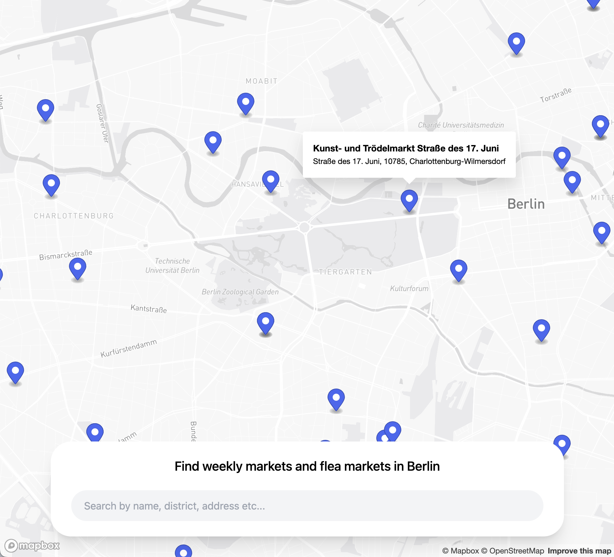

# Berlin Market Explorer

A small app for exploring weekly markets and flea markets in Berlin, built with Vue 3, TypeScript and RxJS.

<figure>
    
</figure>

## Features

The app allows you to view available markets in Berlin via an interactive 3D map, powered by Mapbox.

Each market is represented by a blue marker, and clicking on it opens a popup that shows its name and its address (street, postal code, and district).

It's possible to filter the markets by using the input field in the bottom of the screen, and querying by market name, district, address, etc...

The market list is fetched via a public API, and a new HTTP request is dispatched upon typing in the input field.

In order to avoid spamming the API with unnecessary calls, requests are debounced by 500ms, and results are cached.

## Architecture

The app is built using what's called a "Reactive Clean Architecture", that helps us keep our business logic isolated from the UI, and very very easy to test.

It does so, by separating the app into 4 distinct layers, which are:

### Domain

This layer simply defines a bunch of interfaces (what entities make up our domain, and what interface the infrastructure layer should adhere to).

### Infrastructure

In this layer, we implement the interfaces defined in our domain layer, communicate with the outer world, and map data received from outside to something that our domain can understand.

### Store

This layer connects our business logic to the UI, and contains our reactive global state. This layer is purposely framework-agnostic, which allows us to have a reactive view model (using the observer pattern), and be able to plug-in any UI we want, without having to change our business logic.

### UI

This is the final layer. If you look at the code, you'll notice there's no props, no events emitted, no local state. Each component simply observes whatever data they need from the store. This makes our components dumb, and very easy to test.

## Tradeoffs

The Mapbox library (`mapboxgl-js`) is very powerful, but it is also very low level, forcing you to use a verbose and imperative approach to working with your map.

For example, let's say I want to add a marker:

```ts
// You need a pointer to the actual map instance
const map = new Map(...)

// You need to manually create the marker
const marker = new Marker(...)

// Manually set the marker's coordinates
market.setLngLat({lat: x, lon: y})

// And finally add it to the map
marker.addTo(map)
```

This is a very simple use-case, but it's already so much work for something that should be as simple as:

```html
<MapboxMap>
  <MapboxMarker lat="x" lon="y" />
</MapboxMap>
```

I wanted to maintain this simple and declarative approach, but, considering the time constraints I had, I decided against creating declarative Map, Marker and Popup components my self, and instead opted to use the `vue-mapbox-ts` package, trading off full control over the map, in favor of simpler code.

## Getting started

### Setting up the environment

First, you'll need to get a Mapbox access token, and place it in a `.env.local` file like this:

```
VITE_APP_MAPBOX_ACCESS_TOKEN="<your-access-token>"
```

To get a token, create a free account at [mapbox.com](https://mapbox.com), then go to your profile and you should have a default public token. Simply copy and paste it into your `.env.local` file.

Once you're done, install dependencies with:

```
$ pnpm i
```

## Scripts

**Run unit tests**

```
$ pnpm test:unit
```

**Launch local dev server**

```
$ pnpm dev
```

**Build for production**

```
$ pnpm build
```

**Serve the production build**

```
$ pnpm preview
```
